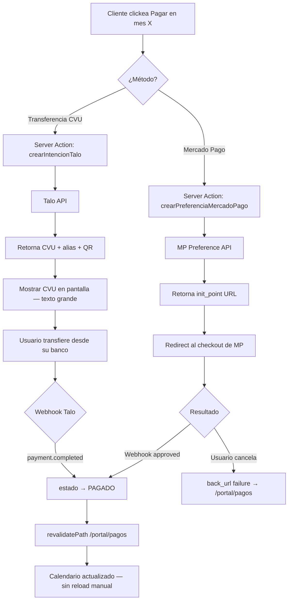

# Plan de trabajo — Capa Frontend / UI
## EscobarInstalaciones — Plataforma de Clientes

> Este documento describe la evolución del proyecto `Ei-LandingPage` (Next.js 16.2.3) para incorporar el portal de clientes y el panel de administración interno, sin tocar la landing page existente.

---

## 1. Estado actual de Ei-LandingPage

### Lo que está construido y funciona

| Componente | Archivo | Estado |
|---|---|---|
| Root Layout | `src/app/layout.tsx` | ✅ Funcional — Inter font, metadata completa |
| Home Page | `src/app/page.tsx` | ✅ Funcional — composición de secciones |
| Navbar | `src/components/layout/Navbar.tsx` | ✅ Funcional — scroll effects, mobile menu |
| Footer | `src/components/layout/Footer.tsx` | ✅ Funcional — info empresa, servicios |
| FloatingWhatsApp | `src/components/layout/FloatingWhatsApp.tsx` | ✅ Funcional — botón fijo bottom-right |
| HeroSection | `src/components/sections/HeroSection.tsx` | ✅ Funcional — CTA, mock UI de seguridad |
| FeaturesSection | `src/components/sections/FeaturesSection.tsx` | ✅ Funcional — 3 feature cards |
| ServicesSection | `src/components/sections/ServicesSection.tsx` | ✅ Funcional — alarmas, CCTV, acceso |
| ContactSection | `src/components/sections/ContactSection.tsx` | ✅ Funcional — info + formulario |
| WhatsAppForm | `src/components/forms/WhatsAppForm.tsx` | ✅ Funcional — RHF + Zod + WhatsApp deeplink |
| Button, Input, Textarea, Select | `src/components/ui/` | ✅ Funcionales — base para reusar |
| siteConfig | `src/config/site.ts` | ✅ Funcional — datos empresa + Zod env |

### Stack actual (confirmado)

- **Next.js 16.2.3** — App Router — compatible con spec (requiere 15+)
- **React 19.2.3** — React Compiler habilitado via `babel-plugin-react-compiler`
- **Tailwind CSS v4** — config vía CSS (`@import "tailwindcss"` en globals.css)
- **TypeScript strict** — paths alias `@/*` → `./src/*`
- **react-hook-form 7.72** + **Zod 4.3.6** — ya instalados
- **lucide-react 0.575** — iconografía ya disponible
- **Deployed:** artifact en `deploy/frontend/12-04-26/despliegue.zip` (122MB) confirma que está en Hostinger

---

## 2. Análisis de compatibilidad con la spec

### Lo que ya encaja

| Requisito de la spec | Estado en Ei-LandingPage |
|---|---|
| Next.js 15+ con App Router | ✅ Tiene 16.2.3 |
| TypeScript strict mode | ✅ Activo |
| Zod para validación | ✅ Instalado y en uso |
| react-hook-form con Zod resolvers | ✅ Instalado y en uso |
| lucide-react para iconografía | ✅ Disponible |
| Componentes UI base reutilizables | ✅ Button, Input, Textarea, Select |

### Lo que necesita ajuste

| Requisito | Brecha | Acción |
|---|---|---|
| `output: 'standalone'` | Falta en `next.config.ts` | Agregar — **crítico para Hostinger** |
| Route groups `(landing)/(portal)/(admin)` | No existen | Migrar estructura de `src/app/` |
| `src/middleware.ts` | No existe | Crear con guards JWT |
| Radix UI Primitives | No instalado | `npm install @radix-ui/react-*` |
| Supabase SSR client | No instalado | `npm install @supabase/supabase-js @supabase/ssr` |
| Prisma client | No instalado | `npm install prisma @prisma/client` |
| date-fns | No instalado | `npm install date-fns` |
| Font 18px base en portal | No configurado | CSS variable en layout del portal |
| Tailwind v4 config para portal | Config JS obsoleta | Usar `@layer` y CSS variables en v4 |

### Tailwind v4 — importante

La landing usa Tailwind v4. En v4, la configuración se hace **en CSS, no en JS**. El `tailwind.config.ts` existente es un stub del setup inicial pero no tiene efecto real. Para configurar el tamaño de fuente base del portal:

```css
/* src/app/(portal)/portal.css — importar en layout del portal */
@layer base {
  :root {
    --font-size-base: 1.125rem; /* 18px */
    --line-height-base: 1.5;
  }
  
  body {
    font-size: var(--font-size-base);
    line-height: var(--line-height-base);
  }
}
```

> **No** modificar `globals.css` (afecta la landing). El layout de `(portal)` importa su propio CSS.

---

## 3. Migración a Route Groups — sin romper la landing

### 3.1 Estructura actual vs estructura objetivo

**Actual:**
```
src/app/
  layout.tsx        ← root layout (landing usa este)
  page.tsx          ← home de la landing
  globals.css
  favicon.ico
```

**Objetivo:**
```
src/app/
  layout.tsx        ← root layout — NO TOCAR (sigue sirviendo a landing)
  globals.css       ← NO TOCAR
  favicon.ico
  (landing)/        ← grupo sin prefijo de URL
    page.tsx        ← home, mueve el contenido actual de page.tsx
  (portal)/
    layout.tsx      ← font 18px, skip-to-content, no sidebar
    login/
      page.tsx
    dashboard/
      page.tsx
    cuentas/
      page.tsx
      [id]/
        page.tsx
    pagos/
      page.tsx
    solicitud/
      page.tsx
  (admin)/
    layout.tsx      ← sidebar, navegación lateral
    dashboard/
      page.tsx
    clientes/
      page.tsx
      [id]/
        page.tsx
    cuentas/
      page.tsx
      [id]/
        page.tsx
    pagos/
      page.tsx
    importar/
      page.tsx
  api/
    webhooks/
      mercadopago/
        route.ts
      talo/
        route.ts
```

### 3.2 Paso a paso de la migración

```bash
# 1. Crear carpeta (landing) y mover el contenido actual
mkdir -p src/app/'(landing)'
mv src/app/page.tsx src/app/'(landing)'/page.tsx

# 2. El root layout.tsx queda donde está — sirve a TODOS los route groups
# 3. Crear las carpetas de portal y admin
mkdir -p src/app/'(portal)'/{login,dashboard,cuentas/'[id]',pagos,solicitud}
mkdir -p src/app/'(admin)'/{dashboard,clientes/'[id]',cuentas/'[id]',pagos,importar}
mkdir -p src/app/api/webhooks/{mercadopago,talo}
```

> **Por qué funciona:** los route groups con `()` no agregan segmento a la URL. La landing sigue en `/`, el portal en `/dashboard`, `/pagos`, etc. No hay choque de rutas.

---

## 4. Modificación de `next.config.ts`

```typescript
// next.config.ts — REEMPLAZAR el contenido actual
import type { NextConfig } from 'next'

const nextConfig: NextConfig = {
  output: 'standalone',        // OBLIGATORIO para Hostinger Node.js Web App
  reactCompiler: true,         // ya estaba — mantener
  experimental: {
    // Para Server Actions con archivos grandes (CSV import)
    serverActions: {
      bodySizeLimit: '10mb',
    },
  },
}

export default nextConfig
```

---

## 5. Layout del portal — accesibilidad base

```typescript
// src/app/(portal)/layout.tsx
import type { Metadata } from 'next'
import './portal.css'

export const metadata: Metadata = {
  title: 'Mi Portal — Escobar Instalaciones',
  robots: 'noindex, nofollow',   // portal privado, no indexar
}

export default function PortalLayout({ children }: { children: React.ReactNode }) {
  return (
    <>
      {/* Skip-to-content — WCAG 2.4.1 */}
      <a
        href="#main-content"
        className="sr-only focus:not-sr-only focus:fixed focus:top-4 focus:left-4 focus:z-50 focus:bg-white focus:text-slate-900 focus:px-4 focus:py-2 focus:rounded focus:shadow-lg focus:text-lg"
      >
        Ir al contenido principal
      </a>

      <div className="min-h-screen bg-slate-50">
        <PortalHeader />
        <main id="main-content" tabIndex={-1} className="portal-main">
          {children}
        </main>
        <PortalFooter />
      </div>
    </>
  )
}
```

```css
/* src/app/(portal)/portal.css */
@layer base {
  /* Font base 18px para todo el portal — WCAG 1.4.4 */
  .portal-main {
    font-size: 1.125rem;
    line-height: 1.6;
  }
}
```

---

## 6. Layout del admin

```typescript
// src/app/(admin)/layout.tsx
import { redirect } from 'next/navigation'
import { createClient } from '@/lib/supabase/server'
import { prisma } from '@/lib/prisma/client'

export default async function AdminLayout({ children }: { children: React.ReactNode }) {
  const supabase = await createClient()
  const { data: { user } } = await supabase.auth.getUser()
  if (!user) redirect('/login')

  const perfil = await prisma.perfil.findUnique({ where: { id: user.id } })
  if (perfil?.rol !== 'ADMIN') redirect('/portal/dashboard')

  return (
    <>
      <a href="#main-content" className="sr-only focus:not-sr-only focus:fixed focus:top-4 focus:left-4 focus:z-50 focus:bg-white focus:px-4 focus:py-2 focus:rounded">
        Ir al contenido principal
      </a>
      <div className="flex min-h-screen">
        <AdminSidebar perfil={perfil} />
        <main id="main-content" tabIndex={-1} className="flex-1 p-6">
          {children}
        </main>
      </div>
    </>
  )
}
```

---

## 7. Pantallas del portal — especificación por componente

### 7.1 Login — `/login`

**Criterios:**
- 3 métodos de login como tabs grandes (mín 44px de alto)
- Sin CAPTCHA — la demografía objetivo no puede resolverlos
- Labels explícitos en cada campo (`<label htmlFor>`)
- Error messages descriptivos, no solo colores
- Mejora progresiva: funciona sin JS (Server Actions nativos)

**Estructura visual:**
```
┌─────────────────────────────────────┐
│  Escobar Instalaciones — Mi Portal  │
│                                     │
│  ┌─ Ingresá con ──────────────────┐ │
│  │  [Email] [WhatsApp] [DNI]      │ │
│  └────────────────────────────────┘ │
│                                     │
│  [Tab activo: formulario de método] │
│                                     │
│  [Botón grande: INGRESAR]           │
│                                     │
│  ¿Problemas para ingresar?          │
│  Llamanos al 343-657-5372           │
└─────────────────────────────────────┘
```

```typescript
// src/app/(portal)/login/page.tsx
import * as Tabs from '@radix-ui/react-tabs'
import { LoginEmailForm, LoginWhatsAppForm, LoginDniForm } from './forms'

export default function LoginPage() {
  return (
    <main className="min-h-screen flex items-center justify-center bg-slate-50 px-4">
      <div className="w-full max-w-md bg-white rounded-xl shadow-md p-8">
        <h1 className="text-2xl font-bold text-slate-900 mb-6">
          Mi Portal — Escobar Instalaciones
        </h1>

        <Tabs.Root defaultValue="email">
          <Tabs.List
            className="flex gap-1 mb-6 p-1 bg-slate-100 rounded-lg"
            aria-label="Método de ingreso"
          >
            <Tabs.Trigger
              value="email"
              className="flex-1 py-3 text-sm font-medium rounded-md data-[state=active]:bg-white data-[state=active]:shadow-sm min-h-[44px]"
            >
              Email
            </Tabs.Trigger>
            <Tabs.Trigger
              value="whatsapp"
              className="flex-1 py-3 text-sm font-medium rounded-md data-[state=active]:bg-white data-[state=active]:shadow-sm min-h-[44px]"
            >
              WhatsApp
            </Tabs.Trigger>
            <Tabs.Trigger
              value="dni"
              className="flex-1 py-3 text-sm font-medium rounded-md data-[state=active]:bg-white data-[state=active]:shadow-sm min-h-[44px]"
            >
              DNI
            </Tabs.Trigger>
          </Tabs.List>

          <Tabs.Content value="email"><LoginEmailForm /></Tabs.Content>
          <Tabs.Content value="whatsapp"><LoginWhatsAppForm /></Tabs.Content>
          <Tabs.Content value="dni"><LoginDniForm /></Tabs.Content>
        </Tabs.Root>

        <p className="mt-6 text-sm text-slate-600">
          ¿Problemas para ingresar?{' '}
          <a href="https://wa.me/5493436575372" className="text-orange-600 underline min-h-[44px] inline-block">
            Escribinos al WhatsApp
          </a>
        </p>
      </div>
    </main>
  )
}
```

### 7.2 Dashboard — `/portal/dashboard`

**Criterios:**
- Listado de cuentas del cliente con estado visual triple canal (color + icono + texto)
- Sin menús anidados — navegación plana
- Cada cuenta como card con botón claro de "Ver detalle"

```typescript
// src/app/(portal)/dashboard/page.tsx
import { createClient } from '@/lib/supabase/server'
import { prisma } from '@/lib/prisma/client'
import { CuentaCard } from '@/components/portal/CuentaCard'
import { redirect } from 'next/navigation'

export default async function DashboardPage() {
  const supabase = await createClient()
  const { data: { user } } = await supabase.auth.getUser()
  if (!user) redirect('/login')

  const cuentas = await prisma.cuenta.findMany({
    where: { perfil_id: user.id, estado: { not: 'BAJA_DEFINITIVA' } },
    include: {
      sensores: { where: { alerta_mant: true } },
      pagos: {
        where: { anio: new Date().getFullYear(), mes: new Date().getMonth() + 1 },
        take: 1,
      },
    },
    orderBy: { descripcion: 'asc' },
  })

  return (
    <section aria-labelledby="cuentas-heading">
      <h1 id="cuentas-heading" className="text-2xl font-bold text-slate-900 mb-6">
        Mis servicios
      </h1>

      {cuentas.length === 0 ? (
        <p className="text-slate-600">No tenés servicios activos.</p>
      ) : (
        <ul className="grid gap-4 sm:grid-cols-2" role="list">
          {cuentas.map(cuenta => (
            <li key={cuenta.id}>
              <CuentaCard cuenta={cuenta} />
            </li>
          ))}
        </ul>
      )}
    </section>
  )
}
```

### 7.3 Vista de cuenta — `/portal/cuentas/[id]`

**Criterios:**
- Lista de sensores con etiqueta legible, tipo, estado de batería y estado operativo
- Botón prominente para solicitar mantenimiento
- Historial de pagos recientes (últimos 3 meses)

### 7.4 Calendario de pagos — `/portal/pagos`

Ver especificación completa en Sección 9.

### 7.5 Formulario de mantenimiento — `/portal/solicitud`

**Criterios:**
- Formulario simple: ¿Qué cuenta? + descripción del problema
- Texto de ayuda claro debajo de cada campo
- Confirmación visible tras el envío
- Funciona sin JavaScript (mejora progresiva)

---

## 8. Pantallas del admin — especificación

### 8.1 Dashboard admin — `/admin/dashboard`

Métricas clave:
- Cuentas activas / suspendidas por pago / en mantenimiento
- Solicitudes pendientes
- Pagos del mes corriente (cobrados vs pendientes)

### 8.2 Clientes — `/admin/clientes`

- Listado con búsqueda por nombre/DNI/teléfono
- Botón "Nuevo cliente" con formulario de alta (3 métodos de identificación)
- Al hacer clic en cliente → ver perfil + sus cuentas

### 8.3 Cuentas — `/admin/cuentas`

- Listado con filtros por estado/categoría
- Vista de cuenta con todas las cuentas del admin (a diferencia del portal que filtra por usuario)
- Edición de costo mensual, estado, notas técnicas

### 8.4 Pagos — `/admin/pagos`

- Vista mensual de todos los pagos
- Formulario de registro manual (efectivo/cheque)
- Al registrar manual: actualiza estado PAGADO + registrado_por

### 8.5 Importar — `/admin/importar`

- Uploader de archivo CSV con drag & drop
- Preview de las primeras 5 filas antes de confirmar
- Log de resultados: N filas OK, M errores con descripción
- Funciona con archivos de hasta 10MB (configurado en next.config.ts)

---

## 9. Calendario de pagos — especificación completa

### 9.1 Estados y representación visual

| Estado | Color fondo | Contraste | Icono | Texto visible | aria-label |
|---|---|---|---|---|---|
| `VENCIDO` | `#b91c1c` (rojo) | >7:1 | ⚠️ triángulo grueso | "DEUDA — $20.000" | "Pago de enero vencido, debe $20.000" |
| `PENDIENTE` | `#78350f` (ámbar) | >4.5:1 | 🕐 reloj | "PENDIENTE" | "Pago de enero pendiente" |
| `PROCESANDO` | `#1d4ed8` (azul) | >4.5:1 | 🔄 spinner | "PROCESANDO" | "Pago de enero en proceso" |
| `PAGADO` | `#15803d` (verde) | >7:1 | ✓ check grueso | "ABONADO" | "Pago de enero abonado" |
| Sin datos / futuro | `#64748b` (gris) | — | — | "—" | "Sin información" |

> **WCAG 1.4.1 — uso del color:** El estado nunca se comunica solo por color. Triple canal simultáneo: color + icono geométrico + texto visible.

### 9.2 Componente CalendarioPagos

```typescript
// src/components/portal/CalendarioPagos.tsx
'use client'
import { format, getYear, getMonth } from 'date-fns'
import { es } from 'date-fns/locale'
import type { Pago, EstadoPago } from '@prisma/client'

const MESES = ['Ene', 'Feb', 'Mar', 'Abr', 'May', 'Jun', 'Jul', 'Ago', 'Sep', 'Oct', 'Nov', 'Dic']

interface EstadoConfig {
  bg: string
  text: string
  icono: string
  label: string
  etiqueta: string
}

const ESTADOS: Record<EstadoPago | 'SIN_DATOS', EstadoConfig> = {
  VENCIDO: {
    bg: 'bg-red-700',
    text: 'text-white',
    icono: '⚠',
    label: 'vencido',
    etiqueta: 'DEUDA',
  },
  PENDIENTE: {
    bg: 'bg-amber-800',
    text: 'text-white',
    icono: '○',
    label: 'pendiente',
    etiqueta: 'PENDIENTE',
  },
  PROCESANDO: {
    bg: 'bg-blue-700',
    text: 'text-white',
    icono: '↻',
    label: 'procesando',
    etiqueta: 'PROCESANDO',
  },
  PAGADO: {
    bg: 'bg-green-700',
    text: 'text-white',
    icono: '✓',
    label: 'abonado',
    etiqueta: 'ABONADO',
  },
  SIN_DATOS: {
    bg: 'bg-slate-200',
    text: 'text-slate-500',
    icono: '',
    label: 'sin información',
    etiqueta: '—',
  },
}

interface Props {
  pagos: Pago[]
  anio: number
  onPagar: (mes: number, anio: number) => void
}

export function CalendarioPagos({ pagos, anio, onPagar }: Props) {
  const pagosPorMes = new Map(pagos.map(p => [p.mes, p]))

  return (
    <section aria-labelledby="calendario-heading">
      <h2 id="calendario-heading" className="text-xl font-semibold mb-4">
        Pagos {anio}
      </h2>
      <div
        className="grid grid-cols-3 gap-3 sm:grid-cols-4 lg:grid-cols-6"
        role="list"
        aria-label={`Calendario de pagos del año ${anio}`}
      >
        {MESES.map((mes, idx) => {
          const numMes = idx + 1
          const pago = pagosPorMes.get(numMes)
          const estado = (pago?.estado ?? 'SIN_DATOS') as EstadoPago | 'SIN_DATOS'
          const config = ESTADOS[estado]
          const esAccionable = estado === 'VENCIDO' || estado === 'PENDIENTE'

          return (
            <div
              key={numMes}
              role="listitem"
              className={`${config.bg} ${config.text} rounded-lg p-3 flex flex-col items-center gap-1 min-h-[80px]`}
              aria-label={`${mes} ${anio}: ${config.label}${pago ? ` — $${pago.importe}` : ''}`}
            >
              <span className="text-sm font-medium">{mes}</span>
              {config.icono && (
                <span className="text-xl" aria-hidden="true">{config.icono}</span>
              )}
              <span className="text-xs font-bold">{config.etiqueta}</span>
              {pago && pago.importe && (
                <span className="text-xs">${Number(pago.importe).toLocaleString('es-AR')}</span>
              )}
              {esAccionable && (
                <button
                  onClick={() => onPagar(numMes, anio)}
                  className="mt-1 text-xs underline min-h-[44px] min-w-[44px] px-2 rounded focus:outline-2 focus:outline-white"
                  aria-label={`Pagar ${mes} ${anio}`}
                >
                  Pagar
                </button>
              )}
            </div>
          )
        })}
      </div>
    </section>
  )
}
```

### 9.3 Flujo de pago desde el calendario



---

## 10. Reglas de UI/UX — implementación técnica

### 10.1 Dimensiones táctiles (WCAG 2.5.5)

```typescript
// Aplicar a TODOS los elementos interactivos del portal
// Clase Tailwind:
className="min-h-[44px] min-w-[44px] px-4 py-3"

// Para links inline:
className="inline-block min-h-[44px] leading-[44px]"
```

### 10.2 Tipografía (WCAG 1.4.4 y 1.4.12)

```css
/* En portal.css */
@layer base {
  /* Usar rem/em — NUNCA px para tipografía */
  .portal-main {
    font-size: 1.125rem;      /* 18px base */
    line-height: 1.6;          /* 1.5 mínimo según spec */
    letter-spacing: 0.025em;
  }

  /* Texto debe escalar al 200% sin overflow horizontal */
  .portal-main * {
    max-inline-size: 75ch;    /* Limitar ancho de lectura */
  }
}
```

### 10.3 Formularios — labels explícitos

```typescript
// ✅ CORRECTO
<label htmlFor="dni" className="block text-sm font-medium mb-1">
  Número de DNI
</label>
<input id="dni" name="dni" type="text" />

// ❌ PROHIBIDO — placeholder como único label
<input placeholder="DNI" />
```

### 10.4 Focus visible (WCAG 2.4.7)

```css
/* Asegurar que el outline de focus sea visible en todos los elementos */
@layer base {
  :focus-visible {
    outline: 3px solid #f97316; /* naranja de la marca */
    outline-offset: 2px;
  }
}
```

---

## 11. Componentes de UI — biblioteca con Radix + shadcn

### 11.1 Instalación de Radix UI

```bash
# Solo los primitivos que se van a usar
npm install \
  @radix-ui/react-tabs \
  @radix-ui/react-dialog \
  @radix-ui/react-select \
  @radix-ui/react-toast \
  @radix-ui/react-progress \
  @radix-ui/react-avatar \
  @radix-ui/react-alert-dialog \
  @radix-ui/react-dropdown-menu
```

### 11.2 Scaffolding con shadcn/ui

```bash
# Inicializar shadcn (genera componentes como código propio)
npx shadcn@latest init

# Generar componentes que se copian a src/components/ui/
npx shadcn@latest add button input label select textarea toast dialog
```

> **shadcn/ui NO es una dependencia de runtime.** Los componentes generados se copian al repo y se modifican libremente. Radix Primitives es la base real de accesibilidad.

### 11.3 Estructura de componentes

```
src/components/
  ui/                   ← primitivas base (reutilizables en portal y admin)
    Button.tsx          ← ya existe — verificar que cumple min-h-[44px]
    Input.tsx           ← ya existe — verificar labels
    Textarea.tsx        ← ya existe
    Select.tsx          ← ya existe
    Dialog.tsx          ← NUEVO — para confirmaciones
    Toast.tsx           ← NUEVO — notificaciones de pago
    Badge.tsx           ← NUEVO — estado de sensores
  portal/               ← específicos del portal de clientes
    CuentaCard.tsx      ← card de cuenta en dashboard
    SensorItem.tsx      ← item de sensor con estado batería
    CalendarioPagos.tsx ← calendario con triple canal a11y
    PagoModal.tsx       ← modal de métodos de pago
    SolicitudForm.tsx   ← formulario de mantenimiento
  admin/                ← específicos del panel admin
    ClienteForm.tsx     ← alta de cliente
    PagoManualForm.tsx  ← registro de pago manual
    CsvUploader.tsx     ← uploader de Softguard CSV
    ResultadosImport.tsx← log de importación
```

---

## 12. Integración axe-core en CI

```typescript
// tests/a11y.spec.ts
import { test, expect } from '@playwright/test'
import AxeBuilder from '@axe-core/playwright'

test.describe('Accesibilidad portal', () => {
  test('Login page no tiene violaciones a11y', async ({ page }) => {
    await page.goto('/login')
    const results = await new AxeBuilder({ page })
      .withTags(['wcag2a', 'wcag2aa', 'wcag21aa'])
      .analyze()
    expect(results.violations).toEqual([])
  })

  test('Dashboard no tiene violaciones a11y', async ({ page }) => {
    // requiere login previo
    await page.goto('/portal/dashboard')
    const results = await new AxeBuilder({ page }).analyze()
    expect(results.violations).toEqual([])
  })

  test('Calendario de pagos no tiene violaciones a11y', async ({ page }) => {
    await page.goto('/portal/pagos')
    const results = await new AxeBuilder({ page }).analyze()
    expect(results.violations).toEqual([])
  })
})
```

---

## 13. Tests Playwright — flujos críticos (Fase 5)

```typescript
// tests/auth.spec.ts
test('Login con email y acceso a dashboard', async ({ page }) => {
  await page.goto('/login')
  await page.getByRole('tab', { name: 'Email' }).click()
  await page.getByLabel('Email').fill('cliente@test.com')
  await page.getByLabel('Contraseña').fill('password123')
  await page.getByRole('button', { name: 'Ingresar' }).click()
  await expect(page).toHaveURL('/portal/dashboard')
  await expect(page.getByRole('heading', { name: 'Mis servicios' })).toBeVisible()
})

test('Ver detalle de cuenta y sensores', async ({ page }) => {
  // pre-auth via API
  await page.goto('/portal/cuentas/[id]')
  await expect(page.getByRole('list', { name: /sensores/i })).toBeVisible()
})

test('Iniciar pago con Mercado Pago', async ({ page }) => {
  await page.goto('/portal/pagos')
  const botonPagar = page.getByRole('button', { name: /pagar ene/i })
  await expect(botonPagar).toBeVisible()
  await botonPagar.click()
  // Verifica que aparece el modal con opciones de pago
  await expect(page.getByRole('dialog')).toBeVisible()
})
```

---

## 14. Checklist de avance — Frontend

### Fase 2 — Auth + Portal base

- [ ] Agregar `output: 'standalone'` a `next.config.ts`
- [ ] Crear `src/app/(landing)/page.tsx` (mover contenido actual de `app/page.tsx`)
- [ ] Verificar que `/` sigue funcionando igual después de la migración
- [ ] Crear `src/app/(portal)/layout.tsx` con skip-to-content y font 18px
- [ ] Crear `src/app/(portal)/login/page.tsx` con 3 tabs Radix UI
- [ ] Implementar `LoginEmailForm`, `LoginWhatsAppForm`, `LoginDniForm`
- [ ] Crear `src/app/(admin)/layout.tsx` con sidebar
- [ ] Instalar y configurar Radix UI packages
- [ ] Scaffolding shadcn/ui para Dialog, Toast, Badge
- [ ] Verificar touch targets 44px en todos los elementos del login
- [ ] Test manual: zoom 200% en login → sin overflow horizontal

### Fase 3 — Cuentas y sensores

- [ ] `src/app/(portal)/dashboard/page.tsx` con listado de cuentas
- [ ] `src/components/portal/CuentaCard.tsx`
- [ ] `src/app/(portal)/cuentas/[id]/page.tsx` con sensores
- [ ] `src/components/portal/SensorItem.tsx` con estado batería
- [ ] `src/app/(portal)/solicitud/page.tsx` — formulario de mantenimiento
- [ ] `src/app/(admin)/clientes/page.tsx` — listado con búsqueda
- [ ] `src/app/(admin)/clientes/[id]/page.tsx` — detalle cliente
- [ ] `src/app/(admin)/cuentas/page.tsx` — gestión de cuentas

### Fase 4 — Pagos y calendario

- [ ] `src/components/portal/CalendarioPagos.tsx` — triple canal a11y
- [ ] `src/app/(portal)/pagos/page.tsx`
- [ ] `src/components/portal/PagoModal.tsx` — Modal Radix con opciones MP/Talo
- [ ] Integrar `crearPreferenciaMercadoPago` en el modal
- [ ] Integrar `crearIntencionTalo` — mostrar CVU/alias en texto grande
- [ ] `src/app/(admin)/pagos/page.tsx` — vista mensual + pago manual
- [ ] `src/components/admin/PagoManualForm.tsx`
- [ ] Test: confirmar que el calendario actualiza sin reload al volver del webhook

### Fase 5 — Import, a11y y deploy

- [ ] `src/app/(admin)/importar/page.tsx` — uploader CSV
- [ ] `src/components/admin/CsvUploader.tsx` con preview
- [ ] `src/components/admin/ResultadosImport.tsx`
- [ ] Instalar `@axe-core/playwright` y `@playwright/test`
- [ ] Escribir tests de accesibilidad para login, dashboard y pagos
- [ ] Ejecutar `npx playwright test` — 0 violaciones
- [ ] `npm run build` exitoso con `output: 'standalone'`
- [ ] Verificar que `.next/standalone/` existe y contiene `server.js`
- [ ] Deploy a Hostinger: subir `.next/standalone/` + configurar entry `server.js`
