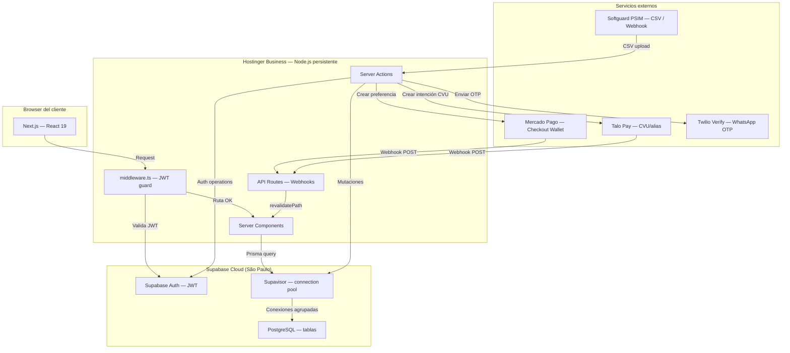
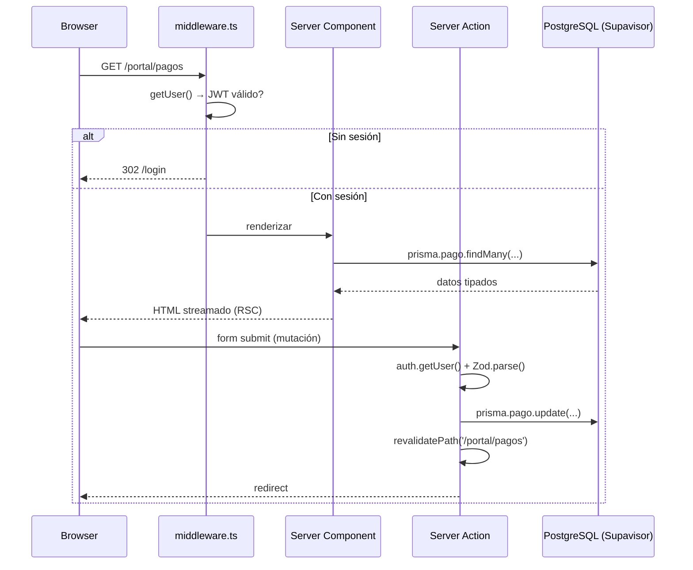
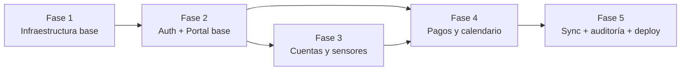

# Plan General de Trabajo
## EscobarInstalaciones — Plataforma de Clientes

> Documento maestro. Lee esto primero. Para el detalle técnico de cada área, ir a:
> - `docs/PLAN-BACKEND.md` — infraestructura, DB, auth, pagos, webhooks
> - `docs/PLAN-FRONTEND.md` — UI, portal, admin, accesibilidad

---

## 1. Visión del proyecto

**Empresa:** Escobar Instalaciones — empresa familiar de instalación de sistemas de seguridad (sensores, cámaras), domótica, antenas StarLink y electrónica general.

**Producto actual:** Landing page en `instalacionescob.ar` — ya desplegada en Hostinger, construida en Next.js 16.2.3.

**Producto a construir:** Portal de clientes + panel de administración interno. Ambos se integran en el mismo proyecto Next.js como route groups separados. La landing no se toca.

**Escala:** ~100 clientes, ~200 cuentas de monitoreo. Tráfico bajo, uso interno. Alta proporción de usuarios adultos mayores con baja alfabetización digital.

**Objetivo funcional:**
- Clientes pueden ver sus cuentas, sensores, historial de pagos y pagar online
- Admin puede gestionar clientes, cuentas, registrar pagos y sincronizar datos de Softguard (PSIM)

---

## 2. Arquitectura general



### Flujo de request estándar



---

## 3. Stack tecnológico — definitivo

| Capa | Tecnología | Versión actual | Notas |
|---|---|---|---|
| Framework | Next.js (App Router) | 16.2.3 | Fullstack — un solo repo |
| Runtime | React | 19.2.3 | Compiler habilitado |
| Lenguaje | TypeScript | 5.x | Strict mode |
| Backend | Server Actions de React | — | Sin API Routes salvo webhooks |
| Base de datos | PostgreSQL vía Supabase | Free tier | São Paulo |
| Auth | Supabase Auth | — | JWT en cookies seguras |
| ORM | Prisma | 6.x | Client singleton |
| Connection pool | Supavisor (nativo Supabase) | — | URL transaccional `:6543` |
| UI base | Radix UI Primitives | — | Headless, a11y nativa |
| Estilos | Tailwind CSS | 4.x | CSS-based config en v4 |
| Scaffolding UI | shadcn/ui | — | Solo generador, no dependencia runtime |
| Validación | Zod | 4.3.6 | Ya instalado |
| Formularios | react-hook-form | 7.72 | Ya instalado |
| Fechas | date-fns | — | Calendario de pagos |
| Hosting | Hostinger Business | — | Node.js Web App, `output: standalone` |
| Pagos 1 | Mercado Pago | — | Checkout Wallet |
| Pagos 2 | Talo Pay | — | REST CVU/alias, ~1% comisión |
| WhatsApp OTP | Twilio Verify | — | Canal: whatsapp |
| Auditoría a11y | axe-core | — | CI en Fase 5 |
| Tests E2E | Playwright | — | Fase 5 |

---

## 4. Mapa del repositorio — estructura objetivo

```
frontend/Ei-LandingPage/           ← proyecto Next.js principal (único repo)
├── prisma/
│   └── schema.prisma              ← modelos: Perfil, Cuenta, Sensor, Pago, etc.
├── src/
│   ├── app/
│   │   ├── layout.tsx             ← root layout — NO TOCAR
│   │   ├── globals.css            ← NO TOCAR
│   │   ├── (landing)/             ← landing existente
│   │   │   └── page.tsx
│   │   ├── (portal)/              ← clientes autenticados
│   │   │   ├── layout.tsx         ← font 18px, skip-to-content
│   │   │   ├── login/page.tsx
│   │   │   ├── dashboard/page.tsx
│   │   │   ├── cuentas/
│   │   │   │   ├── page.tsx
│   │   │   │   └── [id]/page.tsx
│   │   │   ├── pagos/page.tsx
│   │   │   └── solicitud/page.tsx
│   │   ├── (admin)/               ← gestión interna
│   │   │   ├── layout.tsx         ← sidebar, solo ADMIN
│   │   │   ├── dashboard/page.tsx
│   │   │   ├── clientes/[id]/page.tsx
│   │   │   ├── cuentas/[id]/page.tsx
│   │   │   ├── pagos/page.tsx
│   │   │   └── importar/page.tsx
│   │   └── api/
│   │       └── webhooks/
│   │           ├── mercadopago/route.ts
│   │           └── talo/route.ts
│   ├── lib/
│   │   ├── prisma/client.ts       ← singleton Prisma
│   │   └── supabase/
│   │       ├── client.ts          ← browser
│   │       ├── server.ts          ← SSR
│   │       └── admin.ts           ← service_role (bypasea RLS)
│   ├── components/
│   │   ├── ui/                    ← primitivas Radix wrapeadas
│   │   ├── portal/                ← CalendarioPagos, CuentaCard, etc.
│   │   └── admin/                 ← CsvUploader, PagoManualForm, etc.
│   ├── config/
│   │   └── site.ts               ← ya existe
│   └── middleware.ts              ← guards /portal/* y /admin/*
├── .env.local                     ← NO commitear
├── .env.example                   ← commitear (sin valores)
└── next.config.ts                 ← output: standalone
```

---

## 5. Fases de ejecución

### Dependencias entre fases



---

### FASE 1 — Infraestructura base (~3 días)

**Objetivo:** El proyecto arranca limpio con DB, auth y deploy configurados.

**Prerrequisito:** Ninguno.

**Tareas:**

| # | Tarea | Responsable | Archivo(s) |
|---|---|---|---|
| 1.1 | Crear proyecto en Supabase (región São Paulo) | Dev | Supabase Dashboard |
| 1.2 | Copiar ambas URLs (directa + Supavisor) a `.env.local` | Dev | `.env.local` |
| 1.3 | Agregar `output: 'standalone'` en `next.config.ts` | Dev | `next.config.ts` |
| 1.4 | Crear `prisma/schema.prisma` completo (6 modelos + enums) | Dev | `prisma/schema.prisma` |
| 1.5 | Ejecutar `npx prisma migrate dev --name init` | Dev | `prisma/migrations/` |
| 1.6 | Crear singleton Prisma client | Dev | `src/lib/prisma/client.ts` |
| 1.7 | Crear clientes Supabase SSR (browser + server + admin) | Dev | `src/lib/supabase/` |
| 1.8 | Crear `src/middleware.ts` con guards de portal y admin | Dev | `src/middleware.ts` |
| 1.9 | Habilitar RLS en todas las tablas (SQL Editor Supabase) | Dev | Supabase Dashboard |
| 1.10 | Crear policies RLS base | Dev | Supabase Dashboard |
| 1.11 | Crear `.env.example` documentado | Dev | `.env.example` |

**Criterio de done:**
- `npm run build` exitoso con `output: 'standalone'`
- Carpeta `.next/standalone/server.js` presente
- Acceder a `/portal/dashboard` sin sesión → redirige a `/login`
- Acceder a `/admin/dashboard` como CLIENTE → redirige a `/portal/dashboard`

---

### FASE 2 — Auth + Portal base (~4 días)

**Objetivo:** Los 3 flujos de login funcionan. Los layouts del portal y admin existen con la estructura a11y correcta.

**Prerrequisito:** Fase 1 completa.

**Tareas:**

| # | Tarea | Responsable | Archivo(s) |
|---|---|---|---|
| 2.1 | Migrar `app/page.tsx` a `app/(landing)/page.tsx` | Dev | `src/app/(landing)/page.tsx` |
| 2.2 | Verificar que `/` sigue funcionando igual | Dev | Test manual |
| 2.3 | Instalar Radix UI packages, date-fns, mercadopago, csv-parse | Dev | `package.json` |
| 2.4 | Scaffolding shadcn/ui (init + componentes base) | Dev | `src/components/ui/` |
| 2.5 | Crear layout del portal (skip-to-content, 18px) | Dev | `src/app/(portal)/layout.tsx` |
| 2.6 | Crear layout del admin (sidebar, guard ADMIN) | Dev | `src/app/(admin)/layout.tsx` |
| 2.7 | Login page con 3 tabs Radix | Dev | `src/app/(portal)/login/page.tsx` |
| 2.8 | Server Actions para 3 flujos de auth | Dev | `src/app/(portal)/login/actions.ts` |
| 2.9 | Server Action: alta de cliente con DNI (admin) | Dev | `src/app/(admin)/clientes/actions.ts` |
| 2.10 | Test: zoom 200% en login → sin overflow horizontal | Dev | Test manual |
| 2.11 | Test: touch targets ≥44px en todos los elementos del login | Dev | Test manual |

**Criterio de done:**
- Login con email + password funciona end-to-end
- Login con WhatsApp OTP: Twilio envía el código y se verifica
- Login con DNI: el email sintético se crea y el login funciona
- Los 3 layouts tienen skip-to-content visible al tabular

---

### FASE 3 — Cuentas y sensores (~5 días)

**Objetivo:** El cliente puede ver sus cuentas y sensores. El admin puede gestionar clientes.

**Prerrequisito:** Fase 2 completa.

**Tareas:**

| # | Tarea | Responsable | Archivo(s) |
|---|---|---|---|
| 3.1 | Dashboard portal: listado de cuentas del cliente | Dev | `src/app/(portal)/dashboard/page.tsx` |
| 3.2 | Componente CuentaCard con estado visual | Dev | `src/components/portal/CuentaCard.tsx` |
| 3.3 | Vista de cuenta individual + listado de sensores | Dev | `src/app/(portal)/cuentas/[id]/page.tsx` |
| 3.4 | Componente SensorItem con estado batería y zona | Dev | `src/components/portal/SensorItem.tsx` |
| 3.5 | Formulario de solicitud de mantenimiento | Dev | `src/app/(portal)/solicitud/page.tsx` |
| 3.6 | Server Action: crear solicitud de mantenimiento | Dev | `src/app/(portal)/solicitud/actions.ts` |
| 3.7 | Admin: listado de clientes con búsqueda | Dev | `src/app/(admin)/clientes/page.tsx` |
| 3.8 | Admin: formulario de alta de cliente | Dev | `src/components/admin/ClienteForm.tsx` |
| 3.9 | Admin: detalle de cliente con sus cuentas | Dev | `src/app/(admin)/clientes/[id]/page.tsx` |
| 3.10 | Admin: listado y gestión de cuentas | Dev | `src/app/(admin)/cuentas/page.tsx` |
| 3.11 | Verificar navegación con teclado en todas las pantallas | Dev | Test manual |

**Criterio de done:**
- Cliente logueado ve sus cuentas y sensores correctamente
- Formulario de mantenimiento funciona sin JavaScript (mejora progresiva)
- Admin puede crear clientes y ver sus cuentas

---

### FASE 4 — Pagos y calendario (~6 días)

**Objetivo:** El cliente puede pagar online con Mercado Pago o Talo. El calendario refleja el estado real.

**Prerrequisito:** Fase 3 completa.

**Tareas:**

| # | Tarea | Responsable | Archivo(s) |
|---|---|---|---|
| 4.1 | Componente CalendarioPagos con triple canal a11y | Dev | `src/components/portal/CalendarioPagos.tsx` |
| 4.2 | Página de pagos del portal | Dev | `src/app/(portal)/pagos/page.tsx` |
| 4.3 | Server Action: crear preferencia Mercado Pago | Dev | `src/app/(portal)/pagos/actions.ts` |
| 4.4 | Server Action: crear intención Talo Pay | Dev | `src/app/(portal)/pagos/actions.ts` |
| 4.5 | Modal de opciones de pago (Radix Dialog) | Dev | `src/components/portal/PagoModal.tsx` |
| 4.6 | Mostrar CVU/alias de Talo en caracteres grandes | Dev | `src/components/portal/TaloCVU.tsx` |
| 4.7 | Webhook handler Mercado Pago con validación HMAC | Dev | `src/app/api/webhooks/mercadopago/route.ts` |
| 4.8 | Webhook handler Talo Pay con validación HMAC | Dev | `src/app/api/webhooks/talo/route.ts` |
| 4.9 | Admin: vista mensual de pagos | Dev | `src/app/(admin)/pagos/page.tsx` |
| 4.10 | Admin: formulario de pago manual (efectivo/cheque) | Dev | `src/components/admin/PagoManualForm.tsx` |
| 4.11 | Test en sandbox MP: pago → webhook → calendario actualizado | Dev | Test manual |
| 4.12 | Test en sandbox Talo: transferencia → webhook → PAGADO | Dev | Test manual |
| 4.13 | Verificar idempotencia: reenviar webhook → sin duplicados | Dev | Test manual |

**Criterio de done:**
- Calendario muestra triple canal (color + icono + texto) sin solo-color
- Test con lector de pantalla (NVDA/VoiceOver): estado legible sin ver colores
- Pago con MP: el estado cambia a PAGADO sin recargar la página manualmente
- Pago con Talo: el CVU aparece en tamaño grande y legible

---

### FASE 5 — Sync Softguard, auditoría y deploy (~5 días)

**Objetivo:** Importación de datos masiva desde Softguard. Auditoría a11y automatizada. Deploy final a producción.

**Prerrequisito:** Fases 1-4 completas.

**Tareas:**

| # | Tarea | Responsable | Archivo(s) |
|---|---|---|---|
| 5.1 | Server Action: importar CSV Softguard con Node.js Streams | Dev | `src/app/(admin)/importar/actions.ts` |
| 5.2 | Componente CsvUploader con drag & drop + preview | Dev | `src/components/admin/CsvUploader.tsx` |
| 5.3 | Componente ResultadosImport con log de errores | Dev | `src/components/admin/ResultadosImport.tsx` |
| 5.4 | Página de importación admin | Dev | `src/app/(admin)/importar/page.tsx` |
| 5.5 | Instalar `@axe-core/playwright` y `@playwright/test` | Dev | `package.json` |
| 5.6 | Tests de accesibilidad: login, dashboard, pagos | Dev | `tests/a11y.spec.ts` |
| 5.7 | Tests E2E: flujos críticos (login, ver cuenta, pagar) | Dev | `tests/flujos.spec.ts` |
| 5.8 | `npx playwright test` → 0 violaciones WCAG 2.2 AA | Dev | CI |
| 5.9 | `npm run build` final exitoso | Dev | — |
| 5.10 | Configurar variables de entorno en Hostinger hPanel | Dev | Hostinger Panel |
| 5.11 | Deploy: conectar GitHub → Node.js Web App | Dev | Hostinger Panel |
| 5.12 | Verificar entry: `server.js`, output: `.next/standalone` | Dev | Hostinger Panel |
| 5.13 | Prueba de humo en producción: login + ver cuenta + pago | Dev | Test manual |

**Criterio de done:**
- CSV de Softguard se importa sin errores para los datos reales
- Playwright: 0 violaciones axe-core en rutas críticas
- Deploy en Hostinger: el proceso Node.js arranca y se mantiene estable
- Pago con MP real (no sandbox) funciona end-to-end en producción

---

## 6. Variables de entorno — resumen

| Variable | Quién la usa | Origen |
|---|---|---|
| `NEXT_PUBLIC_SUPABASE_URL` | Browser + Server | Supabase Dashboard → Settings → API |
| `NEXT_PUBLIC_SUPABASE_ANON_KEY` | Browser + Server | Supabase Dashboard → Settings → API |
| `SUPABASE_SERVICE_ROLE_KEY` | Solo Server Actions admin | Supabase Dashboard → Settings → API |
| `DATABASE_URL` | Solo `prisma migrate` | Supabase → Settings → Database → URI directa |
| `DATABASE_URL_UNPOOLED` | Runtime Prisma | Supabase → Settings → Database → Supavisor URI |
| `NEXT_PUBLIC_APP_URL` | Server Actions (webhook URLs) | `https://instalacionescob.ar` |
| `MP_ACCESS_TOKEN` | Server Action MP | Mercado Pago → Credenciales |
| `MP_WEBHOOK_SECRET` | Webhook handler | Mercado Pago → Notificaciones |
| `TALO_API_KEY` | Server Action Talo | Talo Pay → API Keys |
| `TALO_WEBHOOK_SECRET` | Webhook handler | Talo Pay → Webhooks |
| `TWILIO_ACCOUNT_SID` | Server Action OTP | Twilio Console |
| `TWILIO_AUTH_TOKEN` | Server Action OTP | Twilio Console |
| `TWILIO_VERIFY_SERVICE_SID` | Server Action OTP | Twilio Console → Verify Services |

---

## 7. Decisiones de arquitectura — NO reabrir

Estas decisiones están cerradas. No se discuten alternativas:

| # | Decisión | Razón |
|---|---|---|
| 1 | **Sin backend separado** | Next.js Server Actions elimina un servicio extra → deploy simpler, $0 adicional |
| 2 | **Hostinger Business es suficiente** | 3GB RAM, 2 CPU, hasta 500 clientes. Upgrade a Cloud Startup si escala |
| 3 | **Supabase Free tier inicial** | 500 MB >> necesidad real (~15 MB), 50K MAUs >> 100 clientes |
| 4 | **Dos URLs de Supabase son obligatorias** | URL directa solo para migraciones. Supavisor para runtime. Mezclarlas agota conexiones |
| 5 | **RLS desde el día 1** | No es opcional. Cada tabla tiene policy. Sin RLS, cualquier bug de auth expone datos de otros clientes |
| 6 | **shadcn/ui es scaffolding, no dependencia** | Los componentes generados viven como código propio. Radix Primitives es la base real de a11y |
| 7 | **Admin en el mismo repo** | Rutas `/admin/*` protegidas por middleware con verificación de `rol === 'ADMIN'` |
| 8 | **WCAG 2.2 es requerimiento funcional** | Alta proporción de adultos mayores. La a11y no es decorativa — si falla, el producto falla |
| 9 | **Mejora progresiva en mutaciones críticas** | `<form action={serverAction}>` funciona sin JS. Crítico para dispositivos lentos |

---

## 8. Checklist de deploy final — Hostinger

### Pre-deploy

- [ ] `npm run build` exitoso localmente
- [ ] `.next/standalone/` existe con `server.js`
- [ ] Variables de entorno de producción cargadas en Hostinger hPanel → Environment Variables
- [ ] Webhooks de Mercado Pago configurados apuntando a `https://instalacionescob.ar/api/webhooks/mercadopago`
- [ ] Webhooks de Talo configurados apuntando a `https://instalacionescob.ar/api/webhooks/talo`
- [ ] `npx prisma migrate deploy` ejecutado contra la DB de producción (usando `DATABASE_URL` directa)

### Deploy en Hostinger hPanel

- [ ] Ir a Hosting → Node.js → Create Application
- [ ] Conectar repositorio GitHub: branch `main`
- [ ] Entry file: `server.js`
- [ ] Output directory: `.next/standalone`
- [ ] Node.js version: 20.x
- [ ] Activar restart automático en crash
- [ ] Deploy → esperar que el proceso Node.js levante

### Post-deploy

- [ ] Acceder a `https://instalacionescob.ar` → landing funciona sin cambios
- [ ] Acceder a `https://instalacionescob.ar/login` → página de login visible
- [ ] Login con email funciona en producción
- [ ] Ver dashboard, cuentas y sensores en producción
- [ ] Realizar un pago de prueba con tarjeta de sandbox de MP
- [ ] Confirmar que el webhook llega y el calendario actualiza
- [ ] Auditoría axe-core en producción (Fase 5)

---

## 9. Glosario — para desarrolladores sin contexto previo

| Término | Definición |
|---|---|
| **Softguard** | PSIM (Physical Security Information Management) que usa Escobar Instalaciones para gestionar sus clientes de monitoreo. Genera reportes CSV con datos de cuentas, sensores y zonas. En el futuro puede enviar webhooks de eventos en tiempo real. |
| **PSIM** | Physical Security Information Management — software de gestión de sistemas de seguridad física (alarmas, sensores, cámaras). |
| **Supavisor** | Connection pooler nativo de Supabase que multiplexa conexiones de clientes (hasta miles) sobre un número reducido de conexiones físicas a PostgreSQL. Evita el agotamiento del pool en servidores compartidos. URL en puerto 6543. |
| **CVU** | Clave Virtual Uniforme — equivalente argentino del IBAN. Identificador único de cuenta bancaria/virtual para recibir transferencias. Talo Pay genera un CVU por cada intención de pago. |
| **Alias** | Nombre legible asignado al CVU (ej: `escobar.instalaciones.talo`). Alternativa al CVU para realizar transferencias. |
| **Talo Pay** | Procesador de pagos argentino orientado a transferencias bancarias (CVU/alias). Comisión ~1%. Permite recibir pagos por transferencia y confirma vía webhook. |
| **Mercado Pago Checkout Wallet** | Flujo de pago de MP donde el usuario paga con su cuenta de MP (saldo, tarjeta guardada). Redirección al dominio de MP para completar el pago. |
| **RLS** | Row Level Security — funcionalidad de PostgreSQL que permite definir políticas de seguridad a nivel de fila. Con RLS activo, cada consulta solo devuelve las filas que la policy permite según el usuario autenticado. |
| **service_role** | Clave de API de Supabase con permisos de superusuario que bypasea RLS. Solo se usa en Server Actions del admin desde el servidor. Nunca se expone al browser. |
| **E.164** | Formato internacional de números de teléfono: `+[código de país][número]`. Ej: `+5491112345678` (Argentina, sin el 0 inicial del código de área). Requerido por Twilio y Supabase para OTP. |
| **Twilio Verify** | Servicio de Twilio para OTP (One-Time Password). Envía el código de 6 dígitos al usuario por el canal configurado (en este caso, WhatsApp). |
| **OTP** | One-Time Password — código de un solo uso, de corta duración (típicamente 10 minutos), usado para autenticación sin contraseña. |
| **Server Action** | Función de servidor en Next.js que se puede llamar desde un componente de React (como si fuera una función normal) pero ejecuta en el servidor. Reemplaza a los API Routes para mutaciones. |
| **Route Group** | Carpeta en el App Router de Next.js cuyo nombre tiene paréntesis `(nombre)`. No agrega segmento a la URL — solo organiza el layout y las rutas. `(portal)` y `(admin)` son route groups. |
| **output: standalone** | Opción de build de Next.js que genera una carpeta `.next/standalone/` con todo lo necesario para correr la app en un proceso Node.js sin `node_modules` completo. Requerido por el setup de Hostinger. |
| **HMAC** | Hash-based Message Authentication Code — algoritmo criptográfico para verificar la autenticidad e integridad de mensajes. Usado por Mercado Pago y Talo para firmar sus webhooks. |
| **Idempotencia** | Propiedad de una operación que produce el mismo resultado si se ejecuta una o múltiples veces. En los webhooks de pago, es crítica: si MP reenvía el mismo evento, la segunda ejecución no debe crear un pago duplicado. Se garantiza con `ref_externa UNIQUE`. |
| **WCAG 2.2** | Web Content Accessibility Guidelines versión 2.2 — estándar internacional de accesibilidad web. Se aplica nivel AA como mínimo (AAA donde sea posible). |
| **skip-to-content** | Link oculto visible solo al tabular con teclado (`:focus`) que permite saltar directamente al contenido principal. Requerido por WCAG 2.4.1. |
| **Triple canal a11y** | Técnica de comunicación de información usando simultáneamente color + forma/icono + texto. Garantiza que usuarios con visión reducida, daltonismo o baja visión puedan entender el estado. |
| **`anon key`** | Clave pública de Supabase usada en el browser. Solo permite operaciones que las policies RLS autoricen para usuarios anónimos o autenticados. No es secreta. |
| **Zona (Softguard)** | Área lógica en el sistema de alarma (ej: "Zona 01 — Ventana Dormitorio"). Cada zona corresponde a un sensor. Softguard usa este código como identificador único dentro de una cuenta. |
